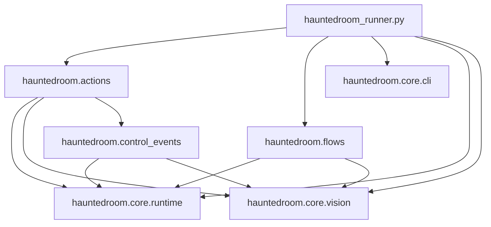

# ADR: Cấu trúc `core / actions / flows`

## Trạng thái

Accepted.

## Bối cảnh

Haunted Room runner có ba nhóm trách nhiệm:

- Khởi tạo CLI/browser và các primitive dùng chung.
- Load và thực thi flow action-driven `Shift+1` từ JSON.
- Thực thi các flow độc lập theo hotkey như auto-map và research.

Khi tất cả module nằm trực tiếp trong `hauntedroom/`, dependency vẫn có thể không
cycle nhưng khó nhìn ra module nào là nền tảng và module nào là business flow.
`common.py` cũng chứa CLI cùng nhiều runtime helper không cùng responsibility.

## Quyết định

Package được tổ chức thành các foundational, execution, flow và control-event
module:

```text
tools/hauntedroom/
├── core/
│   ├── __init__.py
│   ├── cli.py
│   ├── runtime.py
│   └── vision.py
├── actions/
│   ├── __init__.py
│   ├── loader.py
│   └── runner.py
├── control_events/
│   ├── __init__.py
│   └── blockers.py
└── flows/
    ├── __init__.py
    ├── automap.py
    └── research.py
```

Trong project này, `core` có nghĩa là **foundational modules**. Đây không phải
domain layer theo Clean Architecture. Module trong `core` được phép phụ thuộc
stdlib hoặc thư viện ngoài như Playwright, NumPy và OpenCV, nhưng không được
import `actions`, `flows` hay entrypoint.

### Trách nhiệm

- `core/cli.py`: argparse, default launch config, profile và chuẩn bị actions.
- `core/runtime.py`: hotkey, wait/countdown, screenshot lỗi, click logger và
  runtime lifecycle.
- `core/vision.py`: load/capture ảnh và template matching.
- `actions/loader.py`: parse, validate và resolve action JSON.
- `actions/runner.py`: thực thi action, retry và stop mềm.
- `control_events/blockers.py`: kiểm tra và xử lý blocker có quyền tạm thời
  preempt normal flow.
- `flows/automap.py`: flow battle priority của `Shift+2`.
- `flows/research.py`: flow research của `Shift+9`.
- `hauntedroom_runner.py`: composition root, browser bootstrap, hotkey controller
  và hot-reload.

Validation liên quan schema action, bao gồm `validate_threshold`, nằm trong
`actions/loader.py`; `core/vision.py` không biết raw action dictionary.

## Dependency rule

Dependency chỉ được đi xuống hoặc đi ngang trong cùng feature package:



Các rule cụ thể:

1. `core` không import module nào từ `actions` hoặc `flows`.
2. `control_events` chỉ phụ thuộc `core`, không import `actions` hoặc `flows`.
3. `actions` và `flows` không import lẫn nhau.
4. Flow trong `flows` không import flow khác.
5. Entrypoint là nơi nối hotkey với flow; module tầng dưới không import ngược
   `hauntedroom_runner`.

Hiện tại `blockers.py` là control event duy nhất. Chưa tạo enum, registry hay
contract tổng quát. Khi battle win/lose được implement và xuất hiện nhu cầu dùng
chung thật, abstraction sẽ được thiết kế dựa trên behavior thực tế lúc đó.

## Action-driven flow

Flow `Shift+1` giữ ranh giới hai bước:

```text
JSON action file
      ↓
actions.loader.load_actions
  - parse / validate
  - resolve template paths
      ↓
prepared list[dict]
      ↓
actions.runner.run_actions
  - load templates
  - screenshot / match
  - click / wait / retry
```

`run_actions` giả định input đã qua `load_actions`. Auto-map và research không
dùng action JSON và chạy độc lập trong `flows`.

## Hot-reload

`Shift+2` trong dev mode reload `core.vision` trước, sau đó reload
`flows.automap`. Reload theo thứ tự này giúp automap bind các function vision mới
trong khi browser và session hiện tại vẫn được giữ nguyên.

## Hệ quả

### Tích cực

- Nhìn tree có thể nhận ra ngay foundational layer và hai nhóm feature.
- Dependency direction rõ ràng và không có circular import.
- Thêm flow mới không làm action engine hoặc core biết về flow đó.
- Schema action không rò rỉ vào vision layer.
- `common.py` không còn là nơi gom helper không giới hạn.

### Trade-off

- Import path dài hơn, ví dụ `hauntedroom.core.vision`.
- `core/vision.py` hiện vẫn chứa cả pure matching và Playwright page capture.
  Chỉ tách tiếp khi hai phần có lifecycle hoặc consumer khác nhau; chưa tạo thêm
  package chỉ để giảm số dòng.
- Action vẫn dùng raw dictionary cùng metadata key nội bộ. Có thể chuyển sang
  `TypedDict` hoặc dataclass khi schema tiếp tục lớn, nhưng không thuộc refactor
  cấu trúc này.

## Tiêu chí mở rộng

- Thêm hotkey flow: tạo module mới trong `flows/` và đăng ký tại composition root.
- Thêm action type: cập nhật `actions/loader.py` và `actions/runner.py`.
- Thêm foundational capability: chỉ đặt trong `core` nếu capability không biết
  feature nào đang sử dụng nó và không import lên `actions`/`flows`.
