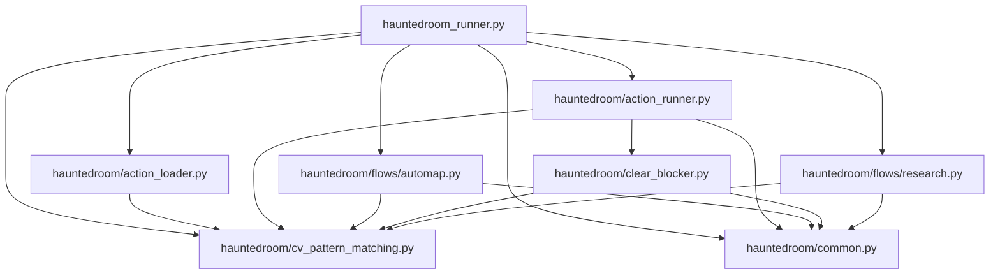
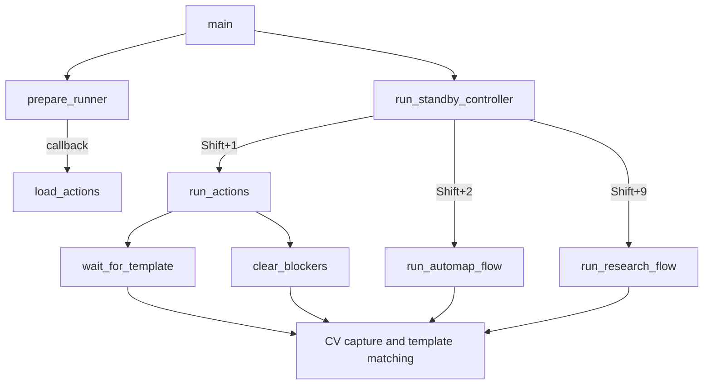
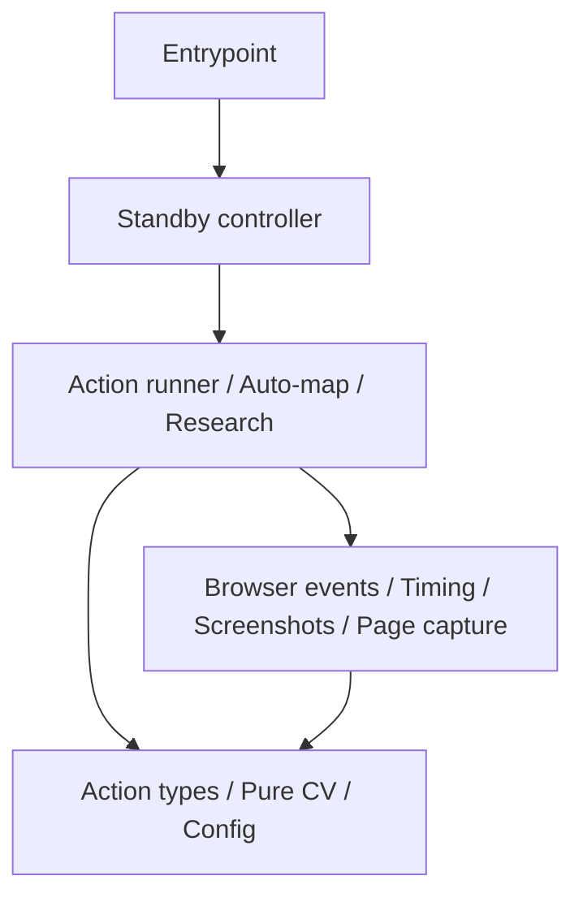

# ADR: Phân tách load actions và run actions

## Bối cảnh

Flow `Shift+1` được mô tả bằng một file JSON chứa các action như `click`,
`click_template`, `clear_blockers` và `wait`. Việc đọc/cấu hình action và việc
điều khiển browser được tách thành hai bước: `load_actions` và `run_actions`.

## Quyết định

### `load_actions(path)`

`load_actions` chịu trách nhiệm đọc và chuẩn bị cấu hình trước khi automation
bắt đầu:

- Đọc JSON từ `path` và yêu cầu root value là một array.
- Validate type cùng các field bắt buộc của từng action.
- Validate threshold, timing, click count và danh sách priority.
- Resolve đường dẫn template tương đối theo thư mục chứa file action.
- Kiểm tra template hoặc thư mục blocker có tồn tại.
- Gắn metadata nội bộ như `_template_path`, `_skip_if_template_path`,
  `_blocker_paths` và `_until_template_path`.
- Trả về `list[dict]` đã được validate và chuẩn bị.

Hàm này không screenshot, không template matching và không click browser. Cấu
hình sai sẽ fail sớm tại đây, trước khi flow được chạy.

### `run_actions(page, actions, loop_count, stop_event)`

`run_actions` chịu trách nhiệm thực thi danh sách đã được `load_actions` chuẩn
bị:

- Load các template đã resolve vào memory bằng OpenCV.
- Chạy action tuần tự theo thứ tự trong array.
- Screenshot page và template matching khi cần.
- Thực hiện click, wait và gọi `clear_blockers`.
- Quản lý số vòng lặp, timeout liên tiếp và retry từ đầu vòng.
- Kiểm tra `stop_event` để `Shift+0` có thể dừng mềm flow.
- Trả về `True` khi hoàn tất, hoặc `False` khi bị dừng mềm.

`run_actions` giả định `actions` đã được validate và có metadata nội bộ cần
thiết. Không truyền trực tiếp JSON thô chưa qua `load_actions` vào hàm này.

## Luồng dữ liệu

```text
JSON action file
      |
      v
load_actions(path)
  - parse
  - validate
  - resolve template paths
      |
      v
prepared list[dict]
      |
      v
run_actions(page, actions, ...)
  - load templates
  - screenshot/match
  - click/wait/retry
```

## Phạm vi áp dụng

Hai hàm trên phục vụ flow action-driven `Shift+1` (`start-exit`). Flow
`Shift+2` (`auto-map`) không dùng action JSON và gọi trực tiếp
`run_automap_flow`. Việc tách riêng giúp logic battle theo priority không bị
ràng buộc vào schema action tuần tự của flow `Shift+1`.

## Dependency graph hiện tại

Mũi tên `A --> B` có nghĩa là module A import module B.



Graph hiện tại không có circular dependency. `common` và
`cv_pattern_matching` là hai dependency ở tầng thấp nhất và không import ngược
lên runner hoặc các flow.

`prepare_runner` nhận `load_actions` qua callback thay vì import runner từ
`common`. Đây là dependency inversion có chủ ý, giúp tránh cycle
`runner -> common -> runner`.

## Runtime flow của các hàm core



## Review structure hiện tại

### Điểm đang tốt

- Dependency graph đi một chiều và chưa có circular import.
- Các flow `start-exit`, `auto-map` và `research` không gọi trực tiếp lẫn nhau.
- CV primitives được dùng chung thay vì duplicate template-matching logic.
- `clear_blockers` đã được tách khỏi runner mà không import ngược runner.
- `stop_event` được truyền từ controller xuống flow, nên flow không cần biết
  hotkey được implement như thế nào.

### Điểm cần chú ý

#### Runner vẫn giữ controller và browser bootstrap

`load_actions`, `wait_for_template` và `run_actions` đã được extract khỏi
`hauntedroom_runner.py`. Runner hiện còn điều phối hotkey, hot-reload và
bootstrap Playwright. Bước tách tiếp theo hợp lý là `controller.py`, nhưng không
cần thực hiện cùng lúc với action extraction.

Nguyên tắc: module được extract không được import `hauntedroom_runner`. Nếu cần
dùng chung type, constant hoặc helper, chuyển dependency đó xuống một module
tầng thấp hơn.

#### `common.py` có cohesion thấp

`common.py` đang chứa CLI parsing, timeout screenshot, countdown, hotkey
listener, click logger và lifecycle chờ `Ctrl+C`. Các flow chỉ cần một helper
nhưng phải phụ thuộc vào module chứa nhiều concern khác.

Tên `common` cũng dễ trở thành nơi đặt mọi helper mới. Về lâu dài nên tách theo
khả năng cụ thể thay vì tiếp tục mở rộng file này.

#### CV đang trộn pure logic và browser I/O

`find_template`, `find_template_matches` và `load_template` là logic CV; trong
khi `capture_page_grayscale` và `capture_page_bgr` phụ thuộc Playwright page.
Tách hai nhóm này sẽ giúp test matching không cần biết browser và giúp các flow
mock screenshot đơn giản hơn.

#### Action dùng raw dictionary và metadata key nội bộ

`load_actions` thêm các key như `_template_path` và `_blocker_paths`, sau đó
`run_actions` ngầm giả định các key này tồn tại. Ranh giới hiện tại hoạt động,
nhưng type checker không thể bảo đảm JSON thô chưa bị truyền thẳng vào runner.

Khi action schema tiếp tục lớn, nên chuyển sang `TypedDict`, dataclass hoặc các
action type riêng. Chưa cần làm bước này trước khi tách module vì đây là thay
đổi rộng hơn.

#### Import CV đang bị chồng kiểu

Runner hiện vừa dùng:

```python
from hauntedroom.cv_pattern_matching import find_template, load_template
from hauntedroom import cv_pattern_matching
```

Import module thứ hai phục vụ `importlib.reload`. Đây không phải circular
import, nhưng function import trực tiếp giữ reference cũ sau khi module được
reload. Kết quả hiện tại:

- `Shift+2` reload CV rồi reload `automap`, nên auto-map nhận function CV mới.
- Các function đã import trực tiếp trong runner vẫn dùng implementation cũ cho
  tới khi process được restart.

Nếu mở rộng hot-reload cho `Shift+1`, nên thống nhất import module và gọi qua
namespace, ví dụ `cv_pattern_matching.find_template(...)`.

## Hướng refactor đề xuất

Hai bước đầu đã hoàn thành mà không tạo dependency cycle:

1. Hoàn thành: `action_loader.py` chứa `validate_timing_fields` và
   `load_actions`.
2. Hoàn thành: `action_runner.py` chứa `wait_for_template`, sentinel và
   `run_actions`; module này import `clear_blocker`, không có chiều import
   ngược lại.

Các bước tiếp theo:

3. Tách controller/hot-reload khỏi entrypoint khi cần tiếp tục làm mỏng runner.
4. Tách `common.py` thành các module có concern cụ thể, ví dụ `cli.py`,
   `browser_events.py`, `timing.py` và `screenshots.py`.
5. Tách `cv_pattern_matching.py` thành pure CV matching và page capture. Pure CV
   phải nằm ở tầng thấp hơn page capture.
6. Khi số flow tăng, thay chuỗi `if command == ...` trong controller bằng flow
   registry. Registry map hotkey sang factory/coroutine và controller không cần
   biết chi tiết từng flow.
7. Sau khi ranh giới module ổn định, thay raw action dictionary bằng typed
   action model.

Dependency direction mục tiêu:



Không module nào ở tầng dưới được import ngược lên tầng trên. Nếu hai module
cần type hoặc constant của nhau, dependency chung đó phải được đưa xuống
`primitives`, thay vì để hai module import lẫn nhau.
