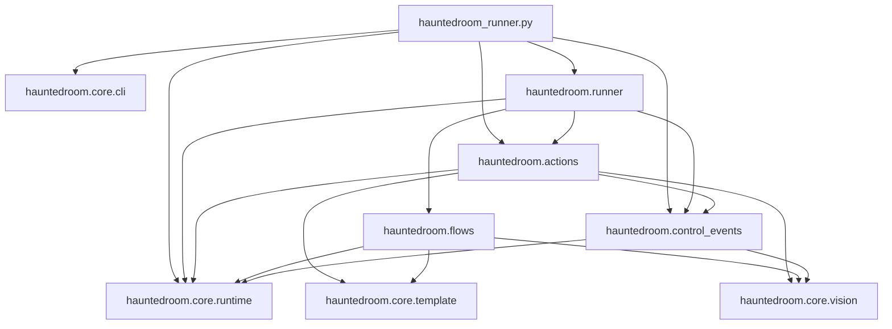

# ADR: Cấu trúc `core / actions / flows`

## Trạng thái

Accepted.

## Bối cảnh

Haunted Room runner có ba nhóm trách nhiệm:

- Khởi tạo CLI/browser và các primitive dùng chung.
- Load và thực thi flow action-driven `Shift+1` từ JSON.
- Thực thi các flow độc lập theo hotkey như auto-map và research.

Khi tất cả module nằm trực tiếp trong `hauntedroom/`, dependency vẫn có thể không
cycle nhưng khó nhìn ra module nào là nền tảng và module nào là business flow.
`common.py` cũng chứa CLI cùng nhiều runtime helper không cùng responsibility.

## Quyết định

Package được tổ chức thành các foundational, execution, flow và control-event
module:

```text
tools/hauntedroom/
├── core/
│   ├── __init__.py
│   ├── cli.py
│   ├── runtime.py
│   └── vision.py
├── actions/
│   ├── __init__.py
│   ├── loader.py
│   └── runner.py
├── control_events/
│   ├── __init__.py
│   ├── blockers.py
│   └── new_tab_blocker.py
├── runner/
│   ├── __init__.py
│   ├── commands.py
│   ├── default_commands.py
│   ├── reload.py
│   └── standby.py
└── flows/
    ├── __init__.py
    ├── automap_support/
    ├── automap.py
    ├── start_auto.py
    └── research.py
```

Trong project này, `core` có nghĩa là **foundational modules**. Đây không phải
domain layer theo Clean Architecture. Module trong `core` được phép phụ thuộc
stdlib hoặc thư viện ngoài như Playwright, NumPy và OpenCV, nhưng không được
import `actions`, `flows` hay entrypoint.

### Trách nhiệm

- `core/cli.py`: argparse, default launch config, profile và chuẩn bị actions.
- `core/runtime.py`: hotkey, wait/countdown, screenshot lỗi, click logger và
  runtime lifecycle.
- `core/template.py`: load template và template matching.
- `core/vision.py`: capture ảnh và OpenCV helper thuần không gắn business rule.
- `actions/loader.py`: parse, validate và resolve action JSON.
- `actions/runner.py`: thực thi action, retry và stop mềm.
- `control_events/blockers.py`: kiểm tra và xử lý blocker có quyền tạm thời
  preempt normal flow.
- `control_events/new_tab_blocker.py`: chặn tab profile từ trang game, xử lý
  fallback đóng tab và inject CSS ẩn game-core iframe sau startup delay 30 giây.
- `runner/commands.py`: dataclass/factory thuần cho hotkey command spec; module
  này không import `runner/reload.py`, `runner/standby.py` hay flow implementation.
- `runner/default_commands.py`: wiring mặc định nối `commands.py`,
  `runner/reload.py` và `flows/start_auto.py` để tạo `FLOW_COMMANDS`.
- `runner/reload.py`: policy hot-reload module Python cho từng nhóm flow.
- `runner/standby.py`: hotkey standby loop, control command `Shift+0`/`Shift+8`,
  pause/resume `Shift+3` và lifecycle task. Module này nhận command table từ
  entrypoint thay vì import `runner/commands.py`.
- `flows/automap.py`: coordinator, state và public API của battle priority
  `Shift+2`.
- `flows/automap_support/`: detector, action và phase orchestration dùng riêng
  bởi auto-map.
- `flows/start_auto.py`: composite flow của `Shift+3`, tái dùng prefix action
  `start_battle.png`, gọi auto-map và cooldown giữa map.
- `flows/research.py`: flow research của `Shift+9`.
- `hauntedroom_runner.py`: composition root và browser bootstrap. Entrypoint nối
  CLI/browser với action runner hoặc standby controller, và inject `FLOW_COMMANDS`
  vào standby.

Validation liên quan schema action, bao gồm `validate_threshold`, nằm trong
`actions/loader.py`; `core/vision.py` không biết raw action dictionary.

Chi tiết business rule và thứ tự xử lý của `Shift+2`/`Shift+3` được giữ riêng
tại [`AUTOMAP_FLOWS.md`](AUTOMAP_FLOWS.md).

## Dependency rule

Dependency chỉ được đi xuống hoặc đi ngang trong cùng feature package:



Các rule cụ thể:

1. `core` không import module nào từ `actions` hoặc `flows`.
2. Module trong `control_events` được import ngang hàng trong cùng package và
   phụ thuộc `core`, nhưng không import `actions` hoặc `flows`.
3. `actions` và `flows` không import lẫn nhau.
4. Flow trong `flows` không import flow khác.
5. `runner` là nơi nối hotkey với flow và action runner; module tầng dưới không
   import ngược `hauntedroom_runner`.
6. Entrypoint không chứa business flow policy; nó bootstrap browser, chọn
   action mode/standby mode và truyền command table vào `runner.standby`.

Hiện tại `blockers.py` là control event duy nhất. Chưa tạo enum, registry hay
contract tổng quát. Khi battle win/lose được implement và xuất hiện nhu cầu dùng
chung thật, abstraction sẽ được thiết kế dựa trên behavior thực tế lúc đó.

## Action-driven flow

Flow `Shift+1` giữ ranh giới hai bước:

```text
JSON action file
      ↓
actions.loader.load_actions
  - parse / validate
  - resolve template paths
      ↓
prepared list[dict]
      ↓
actions.runner.run_actions
  - load templates
  - screenshot / match
  - click / wait / retry
```

`run_actions` giả định input đã qua `load_actions`. Auto-map và research không
dùng action JSON và chạy độc lập trong `flows`.

## Hot-reload

Dev mode reload module Python trước khi bắt đầu flow mới, trong khi browser và
session hiện tại vẫn được giữ nguyên. Policy nằm trong `runner/reload.py`.
`Shift+2`/`Shift+3` reload `core.vision`, action support,
`flows.automap_support` rồi `flows.automap` để các import by-value bind lại
function/constant mới. `Shift+1`/`Shift+3` cũng load lại action JSON trước khi
chạy. `runner.reload.get_automap_runtime()` trả về cặp auto-map flow/action
runner hiện tại; command table trong `runner/default_commands.py` truyền action
runner đó vào `flows.start_auto.run_start_automap_loop()`, nên entry actions của
`Shift+3` dùng runner đã reload mà flow module không cần import `actions`.

## Hệ quả

### Tích cực

- Nhìn tree có thể nhận ra ngay foundational layer và hai nhóm feature.
- Dependency direction rõ ràng và không có circular import.
- Thêm flow mới không làm action engine hoặc core biết về flow đó; chỉ cần đăng
  ký command spec qua factory trong `runner/commands.py` và wiring mặc định trong
  `runner/default_commands.py`.
- Schema action không rò rỉ vào vision layer.
- `common.py` không còn là nơi gom helper không giới hạn.

### Trade-off

- Import path dài hơn, ví dụ `hauntedroom.core.vision`.
- Template matching đã được tách sang `core/template.py`; `core/vision.py` giữ
  capture và primitive OpenCV chung.
- Action vẫn dùng raw dictionary cùng metadata key nội bộ. Có thể chuyển sang
  `TypedDict` hoặc dataclass khi schema tiếp tục lớn, nhưng không thuộc refactor
  cấu trúc này.

## Tiêu chí mở rộng

- Thêm hotkey flow: tạo module mới trong `flows/`, thêm command spec factory
  trong `runner/commands.py` và nối dependency mặc định trong
  `runner/default_commands.py`.
- Thêm action type: cập nhật `actions/loader.py` và `actions/runner.py`.
- Thêm foundational capability: chỉ đặt trong `core` nếu capability không biết
  feature nào đang sử dụng nó và không import lên `actions`/`flows`.
