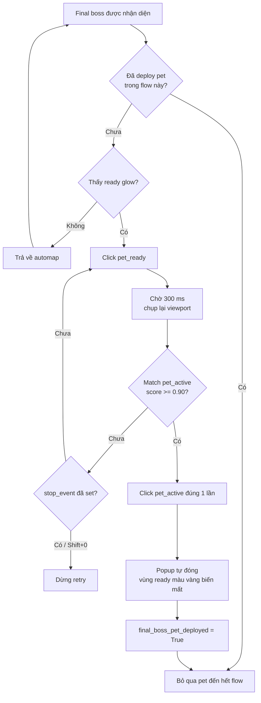

# Auto-map flows: one-map và start-auto

Khi runner idle, `Shift+1` nhận diện màn hình rồi dispatch flow. Màn hình
`automap` chạy business core cho đúng một trận; màn hình `home` chạy start-auto.
Start-auto không có implementation auto-map riêng: nó là wrapper tự vào trận,
gọi cùng business core, chờ cooldown rồi lặp sang map tiếp theo. Tài liệu này là
nguồn mô tả chính cho thứ tự ưu tiên, điều kiện và kết quả của cả hai flow.

| Hành vi | One-map (`automap`) | Start-auto (`home`) |
|---|---|---|
| Cách khởi chạy khi idle | `Shift+1` trên màn hình `automap` | `Shift+1` trên màn hình `home` |
| Vào room và bắt đầu trận | Người dùng thực hiện trước | Tự chạy prefix action enter/exit từ JSON |
| Auto-map trong trận | Chạy `run_automap_flow()` một lần | Gọi cùng `run_automap_flow()` trong mỗi loop |
| Hotkey pause khi flow đang chạy | `Shift+1` ngay lập tức; `Shift+2` ở boss kế tiếp; `Shift+3` ở final boss | Giống one-map |
| Cooldown giữa map | Không | 2 giây |
| Đếm win xuyên nhiều map | Không | Có |

## Business core dùng chung

Trước khi core bắt đầu, trận đã được khởi động: người dùng làm thủ công với
one-map, còn wrapper start-auto tự chạy các entry action. Core chụp viewport liên
tục, chạy các handler theo priority và chỉ xử lý tình huống đầu tiên match trong
mỗi vòng quét.

Core kết thúc khi:

- map hoàn tất và màn hình home đã sẵn sàng;
- người dùng bấm `Shift+0` để dừng mềm và đưa runner về idle.

Pause ở boss không kết thúc core: flow click pause trong game, chờ người dùng
resume bằng `Shift+1`, rồi tiếp tục đúng state hiện tại.

### Priority loop

```text
capture viewport
      |
      v
1. level-spin interrupt
2. map end (throttle tối đa một lần mỗi 5 giây)
3. initial gear setup
4. boss critical handoff
5. level up
6. build structure
7. hero level-up
      |
      +-- không handler nào match: chờ 600 ms rồi quét lại
      +-- handler đã xử lý: bắt đầu vòng quét mới từ priority 1
```

Priority là contract của flow. Handler ở trên được quyền preempt handler ở dưới;
khi thêm tình huống mới phải xác định rõ vị trí của nó trong danh sách này.

### 1. Level-spin interrupt

- Chỉ tìm `automap/lv_spin.png` trong 25% phía dưới viewport.
- Match ở scale `1.0`, `0.8` hoặc `0.67`, threshold `0.58`.
- Click lệch trái `70 px` so với tâm match.
- Kiểm tra lại ngay sau khi click `lv_up` và trước bước confirm để interrupt
  không bị bỏ lỡ trong lúc chuyển phase.

### 2. Map end

Map-end không kết thúc ngay khi `automap/map_end.png` xuất hiện. Match này chỉ
bắt đầu **map lifecycle**: đóng toàn bộ reward/prompt/blocker, xác
nhận home đã thật sự sẵn sàng rồi mới cho start-auto chạy map kế tiếp.

Xem [Map lifecycle](MAP_LIFECYCLE.md) để có call chain, state
machine đầy đủ và review các nhánh retry có thể làm bridge bị stuck.

- Tìm `automap/map_end.png` với threshold `0.90`; phép kiểm tra được throttle
  tối đa một lần mỗi 5 giây.
- Khi match, click để rời battle và chuyển quyền điều khiển sang
  `MapLifecycle`.
- Lifecycle trả `completed=True` chỉ khi `rooms/start_home.png` match threshold
  `0.90`. Việc đã thấy reward hoặc đã tăng win count không đủ để hoàn tất map.
- Nếu lifecycle bị stop, một wait bị ngắt hoặc daily-first-win không hoàn thành,
  lifecycle trả `completed=False` và start-auto dừng, không chạy entry action của
  map tiếp theo.

#### Thứ tự kiểm tra của map lifecycle

Lifecycle dọn theo priority `win reward -> daily first-win -> reward-list/retry
-> fallback/blocker -> home-ready`. Mỗi handler đã action thì lifecycle chụp
frame mới; chỉ `start_home.png` cho phép trả `completed=True`. State machine và
các nhánh retry canonical nằm trong [Map lifecycle](MAP_LIFECYCLE.md).

#### Các nhánh reward và fallback

| Tình huống | Hành vi | Ảnh hưởng tới loop kế tiếp |
|---|---|---|
| Thấy `win_reward.png` | Chỉ match đầu tiên được dùng; click ở mép trên template, lưu vị trí click và gọi `on_win()` đúng một lần trong map hiện tại. | Chưa được chạy map mới; bridge tiếp tục dọn reward-list và chờ home. |
| Reward đã click nhưng title chưa xuất hiện | Không scan/ghi nhận reward lần nữa; click lại vị trí reward đã lưu sau mỗi `2 giây`. | Giữ bridge ở map hiện tại cho tới khi title xuất hiện hoặc flow bị stop. |
| `reward_list_title.png` còn hiện | Tìm trong region `(180, 200, 460, 300)`, click top-middle, đánh dấu `title_seen` và kiểm tra lại sau `2 giây`. Nếu popup vẫn còn thì click lại. | Chỉ khi title biến mất mới tiến tới home/fallback check. |
| Không thấy reward và title | Chờ `3 giây` rồi click `(220, 560)`, tối đa hai lần. | Cho UI có cơ hội đóng animation/popup trước khi kiểm tra blocker và home. |
| Có post-map blocker | Sau hai fallback click, tìm các template trong `rooms/blocker/`, click blocker đầu tiên match rồi scan lại. `overlay_newbie.png` dùng vị trí `top_middle`; blocker khác dùng tâm. | Không đánh dấu hoàn tất khi blocker còn che home. |
| Home xuất hiện mà không thấy reward | Vẫn có thể trả `completed=True` sau fallback/blocker cleanup. `win_recorded` giữ `False`, vì vậy win count không tăng. | Start-auto vẫn có thể tiếp tục map sau vì completion và win-count là hai contract độc lập. |

#### Daily first-win

Handler chỉ xử lý prompt khi first-win còn pending: bảo đảm checkbox đã checked
rồi mới decline và không click khi visual chưa rõ. Khi xử lý xong hoặc reward
cho thấy prompt không còn cần thiết, trạng thái done được dùng lại cho các map
trong cùng command run; command mới sẽ reset trạng thái này.

#### Điều kiện kết thúc và dữ liệu trả về

`MapOutcome` mang bốn giá trị về `AutomapFlow`:

| Field | Ý nghĩa |
|---|---|
| `completed` | Chỉ `True` khi home template đã match; đây là tín hiệu quyết định start-auto có được nối sang map tiếp theo hay không. |
| `win_recorded` | Reward của map hiện tại đã gọi `on_win()` hay chưa. |
| `total_win` | Tổng win do wrapper start-auto quản lý; không dùng để quyết định map đã hoàn tất. |
| `first_win_done` | Giá trị mới để cập nhật `MapRunState` cho các map sau trong cùng command invocation. |

### 3. Initial gear setup

- Gear setup thuộc business core one-map; start-auto dùng cùng behavior vì gọi
  lại `run_automap_flow()` cho từng map.
- Flow chỉ thử setup gear sau khi đã unlock qua một upgrade milestone ổn định
  như level-up confirm hoặc chọn hero level-up option.
- Nếu gear chưa unlock, đã thử setup trong map hiện tại, hoặc không thấy gear
  button trên frame hiện tại thì handler no-op và priority loop tiếp tục như
  bình thường.
- Khi thấy gear button lần đầu sau unlock, flow đánh dấu đã attempt trước khi
  tương tác để tránh lặp vô hạn trên frame animation hoặc kéo nhầm control ở
  vòng quét sau.
- Logic nhận diện button, mở menu và kéo gear nằm trong
  `flows/automap_support/gear_action.py`.
- Nếu click gear nhưng menu chưa mở, flow click lại tối đa 3 lần trước khi bỏ
  placement của map hiện tại.

### 4. Manual boss pause control

- Tìm HP bar trước để phát hiện cả mini-boss lẫn final boss cần pause.
- Sau khi HP match, tìm component đỏ của icon boss trong vùng HUD phía trên,
  rồi suy ra endpoint của thanh progress ngay trước icon. Cách anchor tương đối
  này chịu được layout HUD lệch vài pixel. Ít nhất `85%` pixel vàng tại endpoint
  là final boss; progress chưa tới endpoint là mini-boss. Classifier không được
  dùng để short-circuit HP detection.
- Nhận diện các cạnh sọc dọc của `boss/boss_hp_bar.png` ở đúng kích thước
  cố định `61x11`, không phụ thuộc màu thanh HP.
- Candidate rõ chỉ hợp lệ khi cả anchor trái và phải của toàn thanh đều match;
  nếu thanh bị chữ/effect che một phần, detector chỉ nhận khi template score
  còn gần ngưỡng và crop grayscale đó có khung tối dạng thanh HP đủ rộng.
- Chỉ tìm thanh HP trong upper battlefield region `(117, 120, 522, 318)`.
  Boss đi từ trên hoặc bên phải sẽ đưa toàn thanh HP qua region này trước
  khi tiến tới cửa. Giới hạn dưới `y2=318` loại HP của cửa ở khu vực phòng.
- Boss và mini-boss có thể dùng cùng hình học thanh HP, nên detector không
  phân loại chúng chỉ từ pixel của thanh. Scope hiện tại chấp nhận
  limitation này; nếu cần phân loại sau này phải thêm stage signal riêng.
- Không xử lý riêng khoảnh khắc thanh máu cuối cạn và chuyển đen; flow chấp nhận
  edge case này và pause trong trạng thái boss thông thường còn thanh máu.
- Trong lúc one-map hoặc start-auto đang chạy, `Shift+2` arm pause một lần ở boss
  bất kỳ; `Shift+3` arm pause một lần ở final boss. Khi boss match policy,
  flow click `rooms/exit_click.png` để pause game,
  rồi pause script bằng `FlowControl`. Flow vẫn sống và chờ manual resume, không
  bấm `exit_confirm`, không handoff và không trở về idle.
- Nếu không match được nút pause game hoặc click lỗi, script vẫn pause theo
  fail-safe và log cảnh báo để người dùng xử lý game thủ công.
- Boss detection log loại boss, vị trí và score một lần khi thanh HP đi vào vùng
  search; log này không lặp theo từng frame trong cùng một lần HP hiện diện. Khi
  không có boss pause policy đang được arm, mini-boss chỉ log/no-op; final boss
  vẫn đi qua nhánh deploy pet nếu pet chưa được deploy trong flow hiện tại.
- Logic nhận diện boss nằm trong `vision/boss_hp.py`,
  `vision/boss_progress.py` và `vision/boss_controls.py`; thao tác tương ứng nằm
  trong `boss_action.py` và orchestration nằm trong `boss_flow.py`.

#### Final-boss pet activation



Contract: chỉ final boss dùng nhánh này; mini-boss bỏ qua. Trạng thái ready được
nhận diện bằng vùng glow màu trong `vision/boss_controls.py`; chỉ popup active
dùng template `boss/pet_active.png`. Cờ deployed thuộc từng auto-map flow. Retry
mở menu không có timeout/max-attempt riêng; nó dừng khi summon thành công, nhận
`stop_event`, hoặc popup active không còn được nhận diện.

### 5. Level up

- Nếu có nhiều match `automap/lv_up.png`, chọn match có `y` lớn nhất.
- Click level-up, chờ `800 ms`, rồi kiểm tra lại `lv_spin`.
- Nếu không có interrupt, click confirm tại `(430, 366)`.

### 6. Build structure

- Nếu có nhiều marker `automap/built.png`, chọn marker có `x` lớn nhất; nếu
  trùng `x`, chọn `y` lớn nhất.
- Sau khi mở menu, duyệt option từ trên xuống và click option đầu tiên có giá
  màu trắng.
- Giá màu đỏ hoặc vàng không được xem là available; nếu không có giá trắng thì
  bỏ qua phase này.

### 7. Hero level-up

Danh sách asset, thứ tự sort, threshold và chi tiết fallback được giữ tại
[`tools/rooms/automap/hero_levelup/README.md`](../tools/rooms/automap/hero_levelup/README.md).

- Nếu popup chưa mở nhưng detector thấy vùng level-up sẵn sàng, click
  `(320, 640)` và poll tối đa 10 lần, mỗi lần `200 ms`.
- Chỉ tìm template hero từ `y=460` trở xuống.
- Tên file trong `rooms/automap/hero_levelup/` bắt đầu bằng số priority; số nhỏ
  hơn được ưu tiên:
  - `00_hero_ascend.png`: viền phát sáng trên đầu card Thần Khí; luôn ưu tiên
    card chứa pattern này và click tại vùng option phía dưới của cùng card.
  - `00_mage_king.png`: Vua Pháp Sư mới, override các priority sau.
  - `01`: Hắc Lữ Bố.
  - `02`: Hanuman.
  - `03`: Cây Giáo Hút Hồn.
  - `04`: Đinh Ba Sấm Sét.
- Template `99_*.png` đánh dấu card nên bỏ qua, ví dụ card tăng sao. Card này bị
  loại khỏi fallback khi còn lựa chọn khác.
- Nếu không template ưu tiên nào match, detector tìm layout 3, 2 hoặc 1 card từ
  panel màu phía dưới. Các khe nhiễu dọc rộng tối đa `3 px` được nối trước khi
  đo chiều rộng để không làm mất card.
- Detector đọc hue từ strip background sạch ở cạnh phải phía dưới mỗi card.
  Card có median hue trong khoảng `130..150` được phân loại là tím.
- Card có median hue trong khoảng `10..25` được phân loại là vàng.
- Matcher luôn kiểm tra ascend trước, sau đó mới tới các template priority còn
  lại. Khi không template nào match, fallback ưu tiên card vàng hợp lệ đầu tiên,
  rồi card tím, cuối cùng mới chọn card đỏ. Log ghi rõ màu fallback đã chọn.
  Card priority `99` chỉ được dùng khi không còn lựa chọn khác.
- Nếu fallback thấy đủ ba card nhưng không card nào vàng hoặc tím, bot lưu một
  screenshot chẩn đoán dưới `.tmp/hauntedroom-fallbacks/`. Có thể tắt bằng
  `CAPTURE_HERO_FALLBACK_SCREENSHOTS`; layout chưa đủ ba card không bị capture.

## One-map: chạy một map

Khi runner idle, `Shift+1` nhận diện màn hình `automap` và gọi
`run_automap_flow()`. Người dùng phải vào map và bấm `start_battle` trước khi
kích hoạt auto-switch. Trong lúc chạy, flow nhận bộ control pause/resume,
pause-at-boss, screenshot và stop giống start-auto. Khi core hoàn tất hoặc dừng,
runner trở về idle và không tự bắt đầu map tiếp theo.

## Start-auto loop

Khi runner idle, `Shift+1` trên màn hình `home` bắt đầu chạy nhiều map liên tiếp.
Trong lúc flow đang chạy, `Shift+1` pause ngay và bấm lại để resume đúng state
hiện tại; `Shift+2` đặt pause một lần khi nhận diện boss bất kỳ; `Shift+3` đặt
pause một lần khi nhận diện final boss. Hai policy boss có thể thay thế nhau
trước khi trigger.
`Shift+8` vẫn chụp screenshot, `Shift+0` dừng hẳn flow, còn các Shift+digit khác
bị ignore cho tới khi flow kết thúc. Flow không restart từ đầu sau khi resume.
Các control trên hoạt động giống nhau trong one-map và start-auto.
Các số này là giá trị của dict `START_AUTO_HOTKEYS` trong
`tools/hauntedroom/settings.py`, nên có thể remap mà không sửa controller.

Mỗi vòng chạy theo thứ tự:

1. Tái sử dụng các action enter/exit từ đầu tới hết action click
   `start_battle.png`; các action exit không được chạy. Entry actions được thử
   tối đa 2 lần khi timeout và dừng ngay sau lần đầu tiên hoàn thành thành công.
2. Gọi `run_automap_flow()` để chạy trọn một lượt business core giống one-map.
   Khi map-end match, lời gọi này chỉ trả thành công sau khi win-map completion
   bridge đã dọn UI và xác nhận home.
3. Nếu completion bridge trả `False`, dừng toàn bộ start-auto loop ngay; không
   chạy loss check, cooldown hoặc entry action mới.
4. Nếu completion bridge trả `True`, kiểm tra map có thất bại hay không. Nếu
   `win_count` không tăng trong map vừa xong, coi đó là một loss và tự arm policy
   pause một lần ở boss đầu tiên cho map kế tiếp (cùng policy với control
   `Shift+2`).
5. Chờ 2 giây rồi bắt đầu vòng tiếp theo.

Contract nối loop là:

```text
start battle
    -> run_automap_flow()
    -> finish_map_from_home()
       -> completed=False: stop start-auto
       -> completed=True: loss check
          -> không thấy reward: arm pause ở boss đầu tiên của map kế
          -> cooldown 2 giây -> start battle kế tiếp
```

Flow giữ `win_count` trong suốt một lần chạy start-auto. Khi auto-map nhận diện
`win_reward.png` lần đầu tiên trong màn reward của một map, `win_count` tăng 1;
các reward còn lại trong cùng màn không làm tăng thêm count. Ngay trước log hoàn
thành auto-map, flow in tổng hiện tại theo format `>>> [total_win] win`.
`win_count` không phải điều kiện nối loop: map chỉ cần completion bridge xác nhận
home. Tuy nhiên, nếu reward không được nhận diện và count không tăng, runner coi
map đó là loss và arm `PAUSE_AT_ANY_BOSS` cho map kế tiếp. Khi boss đầu tiên được
nhận diện, flow click pause trong game rồi pause script; người dùng xử lý game và
resume script bằng hotkey `pause_resume` (mặc định `Shift+1`). Policy này là
one-shot và được consume khi boss match.

Trước log cooldown giữa hai map có một dòng gạch ngang để phân cách log. Detector
thất bại hiện là placeholder `map_was_lost()` và luôn trả về `False`; vì vậy flow
hiện chỉ kết thúc khi bị dừng, auto-map không hoàn tất hoặc có lỗi.

## Hot-reload khi phát triển

Chạy runner với:

```shell
uv run python tools/hauntedroom_runner.py --dev-reload
```

Vòng lặp phát triển là `Shift+0` → sửa code/template/action JSON → bắt đầu lại
flow bằng `Shift+1`. Runner giữ nguyên browser và session, nhưng reload module
Python liên quan tới flow mới. Với one-map/start-auto, runner reload
`core.vision`, action
support, các module `flows.automap_support`, rồi `flows.automap`. Các phase
Package `automap_support/map/` giữ map lifecycle và home detection:
`lifecycle.py`, `model_state.py`, `first_win.py`, `reward.py` và `blocker.py`.
`MapState` là mutable state duy nhất của một map; `MapRunState` sống xuyên nhiều
map trong cùng command invocation.
Các phase khác gồm `upgrade_action.py`, `hero_action.py` và `boss_flow.py`;
detector/action nền nằm trong package `vision/`, `boss_action.py` và
`gear_action.py`. Với start-auto, action JSON cũng được load lại trước khi lấy
prefix `start_battle`. Nếu reload lỗi syntax/import/JSON, runner vẫn mở ở trạng
thái idle để có thể sửa và thử lại.

## Vị trí code và test

- Auto-map coordinator/public API: `tools/hauntedroom/flows/automap.py`.
- Wrapper/composite start-auto: `tools/hauntedroom/flows/start_auto.py`.
- Hotkey standby/controller: `tools/hauntedroom/runner/standby.py`.
- Command spec factory: `tools/hauntedroom/runner/commands.py`.
- Default command wiring: `tools/hauntedroom/runner/default_commands.py`.
- Detector, action và phase rule hỗ trợ:
  `tools/hauntedroom/flows/automap_support/`.
- Template: `tools/rooms/automap/` và `tools/rooms/boss/`.
- Regression test: `tests/automap/`, `tests/hero_select/`, `tests/runner/` và
  fixture trong `tests/fixtures/`.

Xem [TESTING.md](TESTING.md) để biết lệnh chạy test.
