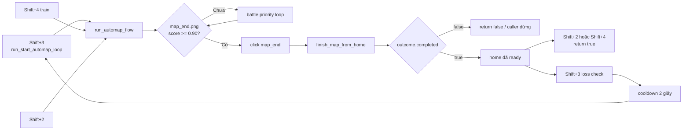
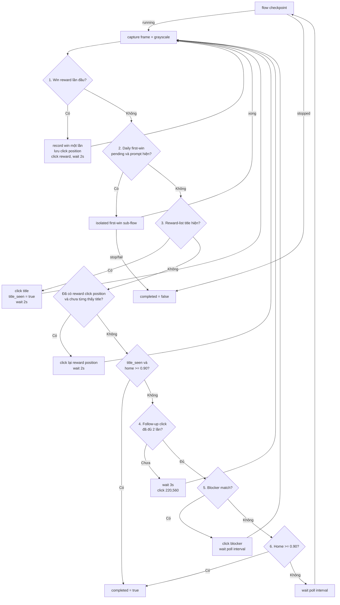
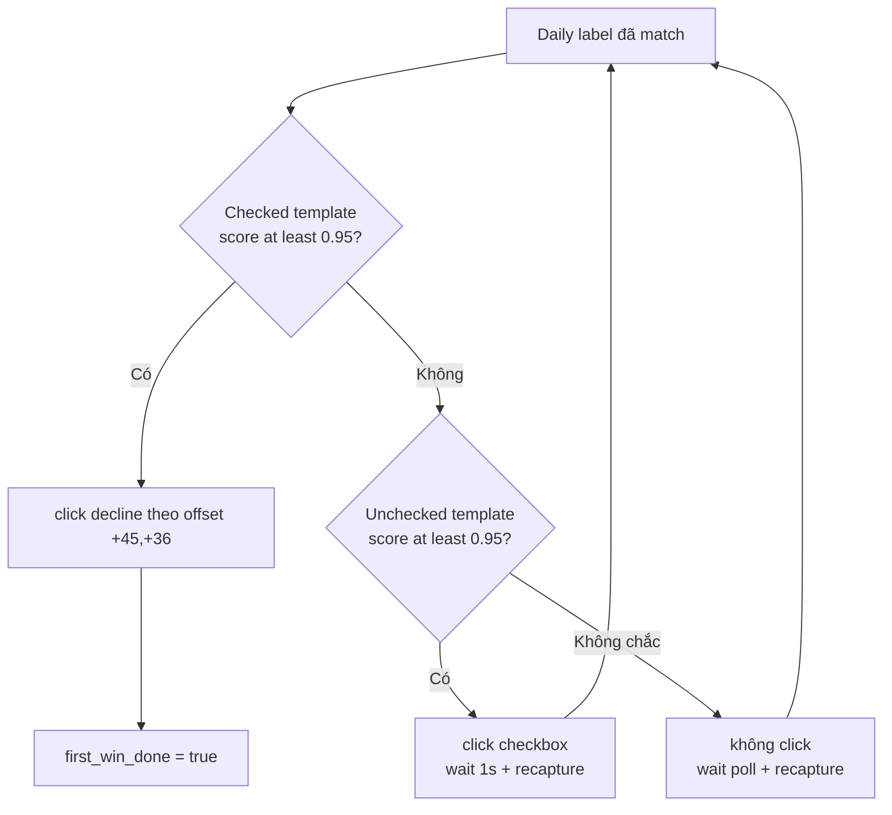

# Map-completion bridge: contract nối các auto-map loop

Tài liệu này mô tả **hành vi code hiện tại** của
`tools/hauntedroom/flows/automap_support/map_completion.py` và package
`completion_flow/`. Đây là bridge từ battle loop về home; nó không chỉ dọn popup
mà còn phát tín hiệu cho caller biết có an toàn để bắt đầu map tiếp theo hay
không.

## Contract quan trọng nhất

`map_end.png` chỉ là trigger bắt đầu cleanup. Map chỉ được xem là hoàn tất khi
`start_home.png` match với score `>= 0.90`.

```text
map_end detected
    -> click rời battle
    -> finish_map_from_home()
    -> dọn reward / daily-first-win / blocker
    -> start_home >= 0.90
    -> MapCompletionOutcome(completed=True)
    -> caller mới được chuyển sang loop kế tiếp
```

Các invariant cần giữ khi sửa flow:

1. Chỉ `_complete_if_home_ready()` được phát `completed=True`.
2. Thấy reward, ghi win hoặc dọn xong một popup **không đồng nghĩa** map complete.
3. Mỗi frame chỉ xử lý nhánh có priority cao nhất; action thành công phải quay lại
   đầu loop và chụp frame mới.
4. `completed=False` phải dừng caller composite; không được chạy entry action của
   map mới.
5. `win_recorded` và `completed` là hai contract độc lập. Không thấy reward vẫn
   có thể complete nếu home đã sẵn sàng.

## Call chain và điểm handoff



Trong battle loop, detector `map_end.png` được throttle: chỉ kiểm tra tối đa một
lần mỗi `5 giây`, threshold `0.90`. Khi match, `AutomapFlow.handle_map_end()`
click match rồi gọi bridge. Handler này trả `handled=True` dù outcome cuối là
true hay false; `AutomapFlow.run()` nhận ra đây là map-end handler và return đúng
giá trị `self.map_completed`.

Với `Shift+3`, `run_start_automap_loop()` return `False` ngay nếu auto-map return
false. Loss check, cooldown và entry action của map sau đều không chạy. Đây là
điểm nối trực tiếp khiến một completion gate bị kẹt sẽ giữ toàn bộ multi-map loop
ở map hiện tại.

## State machine trong bridge

Mỗi handler trả một trong ba `CompletionStep`:

| Step | Ý nghĩa với orchestrator |
|---|---|
| `NOT_HANDLED` | Không match hoặc phase đã xong; thử handler priority kế tiếp trên cùng frame. |
| `CONTINUE` | Đã thao tác/chờ thành công; bỏ phần còn lại của frame và capture frame mới. |
| `STOP` | Wait/checkpoint bị ngắt hoặc sub-flow thất bại; thoát bridge với `completed=False`. |

Priority thực thi hiện tại:



Hai home gate trong diagram dùng cùng `_complete_if_home_ready()`:

- Gate sớm chỉ chạy sau khi `reward_list_title_seen=True` và title đã biến mất
  trên frame hiện tại.
- Gate cuối chỉ chạy sau khi hai follow-up click đã dùng hết và không có blocker
  nào match.

Nếu chưa bao giờ thấy reward-list title, bridge không check home trước khi thực
hiện đủ hai fallback click. Vì vậy trường hợp đi thẳng về home vẫn chờ ít nhất
`2 x 3 giây` và click `(220, 560)` hai lần trước khi được complete.

## Chi tiết từng phase

### 1. Win reward

- Template: `map_win/win_reward.png`, threshold `0.85`, scale `1.0`.
- Chỉ match đầu tiên trong danh sách được dùng.
- Click top-middle của match, lưu vào `reward_click_position`, rồi chờ `2 giây`.
- Khi `reward_click_position` đã có giá trị, detector win reward bị disable cho
  phần còn lại của map.
- `on_win()` chỉ được gọi nếu `win_recorded=False`; kết quả cập nhật `total_win`.
- Nếu reward xuất hiện trước daily prompt, state đặt `first_win_done=True` cho
  process hiện tại.

### 2. Daily first-win

Phase này chỉ vào khi `first_win_done=False` và label daily-first-win match
threshold `0.90`.



Checkbox chỉ được tìm quanh vị trí dự kiến từ label với offset `(-88, -1)` và
padding `8 px`. Sub-flow cố tình không click khi không phân loại chắc chắn để
tránh toggle ngược một checkbox đã checked.

### 3. Reward-list

- Tìm `reward_list_title.png` trong region `(180, 200, 460, 300)` với threshold
  `0.90`, scale `1.0`.
- Khi thấy title: click top-middle, đặt `reward_list_title_seen=True`, chờ
  `2 giây`, rồi scan lại từ đầu.
- Nếu đã click win reward nhưng chưa từng thấy title: click lại vị trí reward cũ,
  chờ `2 giây`, rồi scan lại từ đầu.
- Khi title đã từng xuất hiện nhưng hiện đã biến mất, handler trả
  `NOT_HANDLED`; orchestrator được quyền check home ngay trên frame đó.

### 4. Follow-up click

Nếu các phase trên không handle frame và chưa complete, bridge chờ `3 giây` rồi
click cố định `(220, 560)`. Action này chạy tối đa hai lần cho mỗi map. Trong hai
lần đầu, blocker và generic home gate chưa được kiểm tra.

### 5. Post-map blockers

Sau hai follow-up click, bridge thử blocker theo thứ tự config:

1. `lubu_close.png`
2. `overlay_close.png`
3. `overlay_close_2.png`
4. `overlay_newbie.png`

Threshold là `0.90`; blocker đầu tiên match sẽ được click. `overlay_newbie.png`
dùng `top_middle`, các blocker còn lại click center. Sau click bridge chờ một
poll interval rồi capture lại từ priority đầu.

### 6. Home completion gate

`start_home.png` chỉ match ở scale `1.0`, threshold `0.90`. Match này là đường
duy nhất trả `MapCompletionOutcome(completed=True)`.

Nếu không match, bridge poll vô thời hạn cho tới khi UI chuyển tiếp hoặc
`stop_event` ngắt flow.

## State và phạm vi sống

| State | Phạm vi | Vai trò |
|---|---|---|
| `reward_click_position` | Một map-completion run | Disable scan reward lần hai và làm tọa độ retry trong lúc chờ title. |
| `reward_list_title_seen` | Một map-completion run | Cho phép home gate sớm sau khi title biến mất. |
| `reward_followup_click_count` | Một map-completion run | Giới hạn hardcoded fallback click ở đúng hai lần. |
| `win_recorded` | Một `AutomapFlow`/map | Đảm bảo `on_win()` chỉ chạy một lần cho map đó. |
| `total_win` | Wrapper `Shift+3` | Giá trị log/tổng hợp; không tham gia completion gate. |
| `first_win_done` | Giữ xuyên các map trong process | Bỏ qua daily-first-win sau khi đã xử lý hoặc khi reward xuất hiện mà không có prompt. |

Outcome trả về gồm `completed`, `win_recorded`, `total_win` và
`first_win_done`. `AutomapFlow.finish_map_from_home()` copy ba state sau trở lại
flow/global ngay cả khi `completed=False`.

## Review liveness: các điểm có thể làm flow stuck

Bridge hiện **không có global deadline**. Ngoài hai follow-up click, các retry
đều không có max-attempt. `Shift+0`/`stop_event` là escape hatch duy nhất khi UI
không đạt transition mong đợi.

| Điểm kẹt | Điều kiện | Vì sao không tới completion gate |
|---|---|---|
| Reward position retry | `reward_click_position != None`, title chưa từng match | `handle_reward_list()` luôn trả `CONTINUE`; home, fallback và blocker phía sau không bao giờ chạy, kể cả home đã hiện. |
| Daily-first-win isolated loop | Label biến mất giữa chừng hoặc checked/unchecked không bao giờ đạt `0.95` | Sub-flow tự capture/poll vô hạn và giữ toàn bộ orchestrator ở phase daily-first-win. |
| Reward title còn match | Popup không đóng hoặc template false-positive liên tục | Mỗi vòng click title rồi `CONTINUE`; không check home. |
| Blocker còn match | Click không đóng blocker hoặc false-positive | Mỗi vòng click blocker rồi `CONTINUE`; generic home gate nằm sau blocker. |
| Home false-negative | `start_home.png` đổi hình/scale hoặc bị che | Sau fallback cleanup bridge chỉ poll vô hạn; không có completion signal thay thế. |
| Hardcoded fallback click | UI layout đổi nhưng `(220, 560)` trỏ vào control khác | Hai click có thể tạo state mới ngoài state machine trước khi blocker/home được kiểm tra. |

Rủi ro lớn nhất hiện tại là **reward position retry**: sau khi win reward được
click, nếu UI bỏ qua reward-list và về thẳng home, bridge vẫn click tọa độ cũ vô
hạn và không bao giờ gọi `_complete_if_home_ready()`.

Các guardrail nên cân nhắc khi thay đổi code sau này:

- deadline tổng cho completion bridge;
- max retry hoặc elapsed-time cho reward-position, daily-first-win, title và
  blocker;
- cho phép probe home read-only trước các nhánh retry có thể vô hạn, nhưng vẫn
  giữ blocker/popup priority để tránh false completion;
- log state snapshot/retry count định kỳ để phân biệt UI chậm với detector
  false-negative;
- regression test cho đường `reward clicked -> title skipped -> home visible`.

Những guardrail trên là khuyến nghị review, **chưa phải hành vi đã implement**.

## Source map và regression tests

| Trách nhiệm | File |
|---|---|
| Battle map-end trigger và nhận outcome | `tools/hauntedroom/flows/automap.py` |
| Priority orchestration và home gate | `tools/hauntedroom/flows/automap_support/map_completion.py` |
| State, context, outcome, `CompletionStep` | `tools/hauntedroom/flows/automap_support/completion_flow/state.py` |
| Win reward, reward-list, follow-up click | `tools/hauntedroom/flows/automap_support/completion_flow/reward.py` |
| Daily-first-win isolated flow | `tools/hauntedroom/flows/automap_support/completion_flow/first_win.py` |
| Blocker detection/click | `tools/hauntedroom/flows/automap_support/completion_flow/blocker.py` |
| Multi-map handoff (`Shift+3`) | `tools/hauntedroom/flows/start_auto.py` |
| Regression coverage | `tests/automap/test_map_end.py`, `tests/runner/test_start_automap_loop.py` |

Khi sửa bridge, tối thiểu cần verify cả hai lớp test:

```shell
uv run python -m unittest tests.automap.test_map_end
uv run python -m unittest tests.runner.test_start_automap_loop
```
