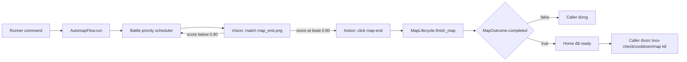
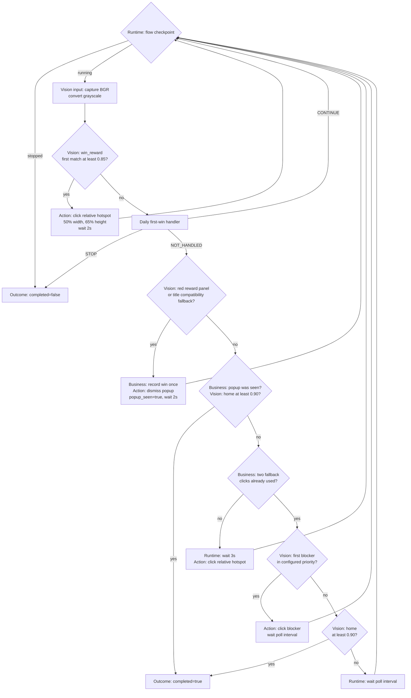

# Map lifecycle

Map lifecycle là boundary nối battle scheduler với home-ready state. Match
`map_end.png` chỉ bắt đầu lifecycle; map chỉ hoàn tất khi `start_home.png` đã
hiện và các reward, daily-first-win prompt, animation hoặc blocker đã được xử
lý.

Tài liệu này là contract canonical cho phần cuối một map. Code cho biết cách
implement; các diagram dưới đây mô tả ý nghĩa business của từng visual signal,
action được phép thực hiện và state transition mà caller dựa vào.

## Contract hoàn tất map

```text
map_end detected
    -> click rời battle
    -> cleanup reward / daily-first-win / blocker
    -> start_home >= 0.90
    -> MapOutcome(completed=True)
    -> caller mới được bắt đầu map tiếp theo
```

Các invariant phải giữ khi sửa flow:

1. `map_end.png` là trigger cleanup, không phải tín hiệu map đã hoàn tất.
2. Chỉ home-ready detection được phát `completed=True`.
3. Ghi nhận win và hoàn tất map là hai contract độc lập. Không thấy reward vẫn
   có thể complete nếu home đã sẵn sàng.
4. Mỗi frame chỉ chạy nhánh priority cao nhất. Sau một action, lifecycle phải
   capture frame mới trước khi đưa ra quyết định tiếp theo.
5. `completed=False` dừng caller composite; không được chạy entry action của map
   mới.

## Ownership và boundary vision/action

```text
AutomapFlow
    └── MapLifecycle
          ├── MapState
          ├── MapRunState
          ├── first_win
          ├── reward
          └── blocker
```

Code nằm trong `tools/hauntedroom/flows/automap_support/map/`:

- `model_state.py`: `MapState`, `MapRunState`, contexts, steps và outcomes.
- `lifecycle.py`: detect/rate-limit map-end và orchestration tới home.
- `reward.py`: win reward, reward-list và fallback clicks.
- `first_win.py`: daily-first-win checkbox flow.
- `blocker.py`: blocker detection và cleanup.

Các module import trực tiếp từ owner; package `map` không re-export model hoặc
runtime function.

Trong lifecycle này, vision và action là hai trách nhiệm khác nhau dù một số
helper hiện vẫn nằm chung module:

| Lớp | Trách nhiệm | Không nên quyết định |
|---|---|---|
| Vision query | Nhận frame, template/ROI/threshold; trả match, tọa độ, score hoặc visual state. | Có click hay không, retry bao lâu, state nào được hoàn tất. |
| Business flow | Diễn giải visual signal theo priority và state hiện tại; chọn transition tiếp theo. | Chi tiết capture hoặc thuật toán template matching dùng chung. |
| Action/runtime | Click, wait có stop-awareness và capture frame mới. | Một visual match có đồng nghĩa map complete hay không. |

Detector, threshold, offset và asset chỉ dùng cho Haunted Room vẫn là game
business và được phép nằm trong `automap_support/`. Nếu tách thêm
`vision/first_win.py` hoặc `vision/map_reward.py`, chỉ chuyển visual query; policy
priority, retry và state transition vẫn thuộc map lifecycle.

## Call chain và handoff



Map-end vision query được throttle tối đa một lần mỗi `5 giây` và dùng threshold
`0.90`. Khi match, lifecycle click vị trí match rồi giữ quyền điều khiển cho tới
khi home ready hoặc flow bị stop. Map-end handler được xem là đã handle frame
ngay cả khi cleanup cuối cùng trả `completed=False`; caller phải đọc riêng field
`completed` để quyết định có được nối loop hay không.

## State lifetime

| State | Phạm vi sống | Vai trò |
|---|---|---|
| `reward_click_position` | Một map | Disable scan reward lần hai và lưu hotspot tương đối đã click. |
| `reward_list_title_seen` | Một map | Ghi nhận popup đã được xác nhận và cho phép probe home sau khi popup biến mất. |
| `reward_followup_click_count` | Một map | Giới hạn tổng số click hotspot ở đúng hai lần. |
| `win_recorded` | Một map | Đảm bảo `on_win()` chỉ chạy một lần sau khi popup reward-list được xác nhận. |
| `completed` | Một map | Kết quả home-ready gate; không suy ra từ `win_recorded`. |
| `daily_first_win_done` | Một command run | Bỏ qua daily prompt ở các map sau trong cùng command invocation. |

`MapState` là mutable state duy nhất cho một map. Nó chứa cả gameplay state
(boss, gear) và lifecycle state (reward, home, win); không tạo state phụ khi
map-end xuất hiện.

`MapRunState` thuộc runner command và được dùng lại qua nhiều map. Hiện nó giữ
`daily_first_win_done`; state này reset khi command mới bắt đầu và không persist
qua lần restart bot. Khi bắt đầu cleanup, giá trị được copy từ `MapRunState` vào
`MapState.first_win_done`; khi cleanup kết thúc, outcome được copy ngược lại.

`MapOutcome` trả bốn field:

| Field | Contract |
|---|---|
| `completed` | Chỉ true khi `start_home.png` match; quyết định caller có được chạy map tiếp theo. |
| `win_recorded` | Reward map hiện tại đã gọi `on_win()` hay chưa. |
| `total_win` | Tổng win do wrapper quản lý; không tham gia completion gate. |
| `first_win_done` | Giá trị đồng bộ về `MapRunState` cho các map sau. |

## Step contract

Mỗi business handler trả một `MapLifecycleStep`:

| Step | Ý nghĩa với orchestrator |
|---|---|
| `NOT_HANDLED` | Visual signal không match hoặc phase đã xong; thử handler priority kế tiếp trên cùng frame. |
| `CONTINUE` | Đã action/wait thành công; bỏ các handler còn lại và capture frame mới. |
| `STOP` | Checkpoint/wait bị ngắt hoặc sub-flow thất bại; trả outcome với `completed=False`. |

`CONTINUE` là guard chống dùng frame cũ: sau khi click làm UI thay đổi, lifecycle
không được dùng lại ảnh trước click để kết luận home ready hoặc chạy action khác.

## State machine tổng

Sau khi click map-end, mỗi vòng chỉ xử lý nhánh đầu tiên match:



Hai home gate dùng cùng một home visual query:

- Gate sớm chỉ chạy khi reward-list popup đã từng xuất hiện và hiện đã biến
  mất.
- Gate cuối chỉ chạy sau khi hai fallback click đã dùng hết và không có blocker
  match.

Nếu chưa từng thấy reward-list popup, lifecycle không check generic home trước
khi thực hiện đủ hai click hotspot. Vì vậy đường đi thẳng về home vẫn có thể
chờ `2 x 3 giây` và click hotspot `(50% width, 65% height)` hai lần trước khi
complete.

## Daily first-win

Handler chỉ chạy khi first-win còn pending và daily label xuất hiện. Nó bảo đảm
checkbox ở trạng thái checked rồi mới decline; visual chưa rõ thì chờ frame mới,
không click mù. Thành công trả `CONTINUE` và đánh dấu done cho cả command run;
không có prompt trả `NOT_HANDLED`, còn checkpoint/wait bị ngắt trả `STOP`.

Khi reward-list popup xác nhận win, daily-first-win vẫn còn pending trong lúc bot
collect home reward. Nếu prompt xuất hiện thì handler xử lý như bình thường; nếu
không xuất hiện, trạng thái chỉ được đánh dấu done khi home-ready xác nhận toàn bộ
cleanup đã hoàn tất. Trạng thái này không thay thế home-ready gate.

## Reward, blocker và home-ready

### Win reward

- Vision tìm `map_win/win_reward.png` ở scale `1.0`, threshold `0.70` và chỉ dùng
  match đầu tiên.
- Match không ghi nhận win; action click fixed reward card dưới nhân vật `(341,414)` theo ratio canvas, lưu tọa độ và chờ
  `2 giây`.
- Khi đã có `reward_click_position`, win-reward query bị disable; nếu một blocker
  xuất hiện sau reward-list, lifecycle re-arm query và fallback để xử lý lại màn
  reward-selection vừa được lộ ra.

### Reward-list

- Primary vision đo tỷ lệ pixel đỏ HSV trong panel ROI tương đối; threshold là
  `0.50`, không phụ thuộc text/ngôn ngữ.
- `reward_list_title.png` trong ROI `(180, 200, 460, 300)`, scale `1.0`, threshold
  `0.90` chỉ còn là compatibility fallback cho theme panel khác.
- Khi popup hiện, business gọi `on_win()` đúng một lần; action click vị trí dismiss
  tương đối, đặt `reward_list_title_seen=True`, chờ `2 giây` và capture lại.
- Khi popup đã từng hiện nhưng nay biến mất, handler trả `NOT_HANDLED`; lifecycle
  được quyền probe home trên frame đó.

### Fallback và blocker

- Nếu các phase trước không handle frame, lifecycle chờ `3 giây` rồi click hotspot
  tương đối `(50% width, 65% height)`, tối đa hai lần cho mỗi map.
- Sau hai click, vision tìm blocker theo priority config. `overlay_newbie.png`
  click `top_middle`; blocker còn lại click center.
- Action blocker thành công luôn dẫn tới capture frame mới trước khi thử home.

### Home-ready

Vision chỉ match `start_home.png` ở scale `1.0`, threshold `0.90`. Đây là visual
signal duy nhất cho phép business flow trả `MapOutcome(completed=True)`.

Không match home thì lifecycle tiếp tục poll cho tới khi UI chuyển tiếp hoặc
`stop_event` ngắt flow.

## Stop behavior và liveness risks

Lifecycle hiện không có global deadline. Ngoài hai fallback click, các retry
không có max-attempt; stop control là escape hatch khi UI không đạt transition
mong đợi.

| Điểm có thể kẹt | Điều kiện | Vì sao không tới home gate |
|---|---|---|
| Daily first-win isolated loop | Label biến mất giữa chừng hoặc cả checked/unchecked đều không đạt `0.95`. | Sub-flow tự wait/capture và chưa trả quyền cho lifecycle. |
| Reward popup | Popup không đóng hoặc detector false-positive liên tục. | Mỗi vòng click dismiss rồi `CONTINUE`. |
| Blocker | Click không đóng blocker hoặc template false-positive. | Mỗi vòng click blocker rồi `CONTINUE`; home gate nằm sau blocker. |
| Home false-negative | Asset, scale hoặc overlay làm `start_home.png` miss. | Không có completion signal thay thế. |
| Relative hotspot | Layout đổi mạnh khiến `(50% width, 65% height)` rời vùng reward. | Hai action có thể đưa UI sang state ngoài state machine, nhưng retry vẫn bị giới hạn. |

Khi cải tiến liveness, cân nhắc:

- deadline tổng cho lifecycle;
- max retry hoặc elapsed-time cho reward-position, daily-first-win, title và
  blocker;
- home probe read-only trước nhánh retry vô hạn, đồng thời vẫn giữ popup/blocker
  priority để tránh false completion;
- log retry count/state snapshot định kỳ;
- regression test riêng cho đường reward-list bị skip.

Các guardrail trên là khuyến nghị review, chưa phải hành vi đã implement.

## Runtime injection

`AutomapFlow` truyền capture và template-matching functions vào `MapLifecycle`.
Battle scheduler và lifecycle vì vậy dùng cùng runtime seam, trong khi lifecycle
vẫn sở hữu map-end policy, business priority và state synchronization.

## Source map và regression tests

| Trách nhiệm | File/test chính |
|---|---|
| Public one-map coordinator | `tools/hauntedroom/flows/automap.py` |
| Map-end, priority orchestration và home gate | `tools/hauntedroom/flows/automap_support/map/lifecycle.py` |
| State, contexts, steps và outcomes | `tools/hauntedroom/flows/automap_support/map/model_state.py` |
| Daily first-win visual query và business sub-flow | `tools/hauntedroom/flows/automap_support/map/first_win.py` |
| Win reward, reward-list và fallback | `tools/hauntedroom/flows/automap_support/map/reward.py` |
| Blocker detection/action | `tools/hauntedroom/flows/automap_support/map/blocker.py` |
| Multi-map caller | `tools/hauntedroom/flows/start_auto.py` |
| First-win regression | `tests/automap/test_daily_first_win.py` |
| Reward/liveness behavior | `tests/automap/test_map_reward.py` |
| Map-end throttle/handoff | `tests/automap/test_map_end.py` |
| Blocker cleanup | `tests/automap/test_map_blocker.py` |
| Multi-map handoff | `tests/runner/test_start_automap_loop.py` |

Khi sửa lifecycle, tối thiểu chạy:

```shell
uv run python -m unittest tests.automap.test_daily_first_win
uv run python -m unittest tests.automap.test_map_reward
uv run python -m unittest tests.automap.test_map_end
uv run python -m unittest tests.automap.test_map_blocker
uv run python -m unittest tests.runner.test_start_automap_loop
```
