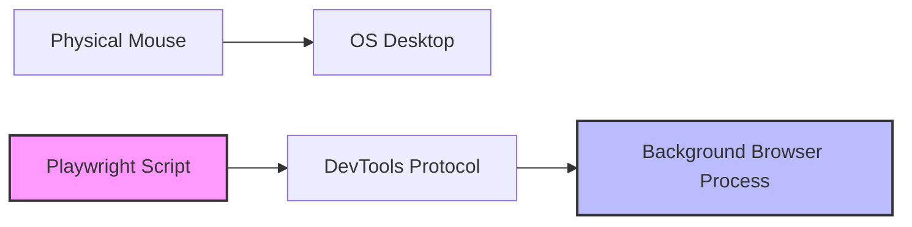

# Technical Analysis: Background Browser Game Automation

This document addresses the feasibility of running browser game automation in the background without capturing or hijacking the user's mouse control, critiquing the current repository's approach, and outlining modern alternatives.

---

## 1. Reformatted Question

> **Core Objective**: Automate a browser-based game in a background window without losing physical mouse control or requiring the browser to remain in focus.
> 
> *   **Q1**: Is it possible to automate a browser game without losing mouse control?
> *   **Q2**: Is the current template-matching and global mouse-simulation ([pynput](pyproject.toml)) approach still suitable, or is it outdated?
> *   **Q3**: What are the best alternative architectures and tools to achieve non-intrusive background game automation?

---

## 2. Detailed Answers & Assessment

### Q1: Is it possible to automate a browser game without losing mouse control?
**Yes, it is entirely possible.** 
By separating the automation interactions from the operating system's physical mouse cursor, you can run automated tasks in a background browser instance (even minimized or headless) while using your physical mouse and keyboard for other tasks.

### Q2: Is the current approach good enough?
**No, the current approach is highly restrictive and outdated.**
The project relies on:
1.  **[mss](pyproject.toml)**: Grabs screenshots of the primary monitor.
2.  **[pynput](pyproject.toml)**: Sends global, OS-level mouse movements and click events.

#### Why the current approach fails modern usability standards:
*   **Mouse Hijacking**: The simulated mouse events move your actual physical pointer. If you move your mouse, you disrupt the bot, and vice versa.
*   **Foreground Constraint**: The game browser must remain active, in focus, and visible at the top-left of the screen. You cannot minimize it or open another window on top of it.
*   **Resolution and Scaling Dependency**: Any OS-level display scaling, high-DPI settings, or dual-monitor configurations will throw off coordinate calculations.

---

## 3. Recommended Architecture: Browser Automation (Playwright)

Since the game runs in a browser environment, the recommended and selected architecture is to orchestrate it using **Playwright** (Python/JS). 

### How it Works
Playwright launches a browser instance (either "headful" in a separate, unfocused background window, or "headless" entirely in memory). It interacts directly with the browser's engine via the Chrome DevTools Protocol (CDP).



### Pure Canvas Constraint: No DOM Interactions Allowed
Because the game runs inside a **pure Canvas/WebGL viewport** with **no HTML DOM elements** (such as `<button>` or `<div>`) representing UI components:
1.  **Visual Perception**: The bot uses Playwright to capture the raw pixels of the canvas viewport:
    ```python
    # Capture canvas screenshot directly from the page layout
    canvas_element = page.locator("canvas")
    img_bytes = canvas_element.screenshot()
    ```
2.  **Computer Vision Location**: The raw bytes are loaded into NumPy/OpenCV (`vision.py`) where template matching locates characters or buttons (like the goalpost or next button) and returns viewport coordinates `(x, y)`.
3.  **Coordinate-Based Input**: The bot dispatches synthetic mouse events to those precise canvas coordinates using Playwright's page mouse API:
    ```python
    # Clicking a button at coordinate (x, y)
    page.mouse.click(x, y)
    ```
This model is highly stable and does not require DOM access, making it perfect for pure canvas games.

### Key Advantages
1.  **Zero Mouse Interruption**: Plays in the background without hijacking or moving the physical cursor.
2.  **Native Cross-Platform Support**: Works identically on Windows, macOS, and Linux out of the box.
3.  **Invisible/Headless Execution**: Can run completely headless in the background without taskbar clutter.
4.  **Deterministic Coordinate Space**: Target canvas resolution (e.g. 1173x660 px) remains constant, bypassing any OS display scaling or monitor scaling issues.

---

## 4. Eliminated Options
For details on other approaches that were ruled out (specifically, **OS-Level Window Messaging** and **Network API Protocol Automation**), see [docs/ELIMINATED_OPTIONS.md](file:///D:/myData/teemp/burrito-bison-bot/docs/ELIMINATED_OPTIONS.md).

---

## 5. Implementation Path for Burrito Bison

To modernize this specific bot, the integration will be rewritten to use **Playwright**:

1.  **Initialize Playwright**:
    ```python
    from playwright.sync_api import sync_playwright

    with sync_playwright() as p:
        browser = p.chromium.launch(headless=True) # or False to watch it run
        page = browser.new_page(viewport={"width": 1173, "height": 660})
        page.goto("http://localhost:8080")
    ```
2.  **Capture Viewport Screen**:
    Use `page.locator("canvas").screenshot()` to acquire binary image frames, converting them directly into numpy arrays for OpenCV template matching.
3.  **Dispatched Input**:
    Instead of using `pynput`, use Playwright's low-level synthetic mouse API:
    ```python
    # Click next button:
    page.mouse.click(x, y)

    # Slingshot drag and release launch:
    page.mouse.move(start_x, start_y)
    page.mouse.down()
    page.mouse.move(end_x, end_y)
    page.mouse.up()
    ```
