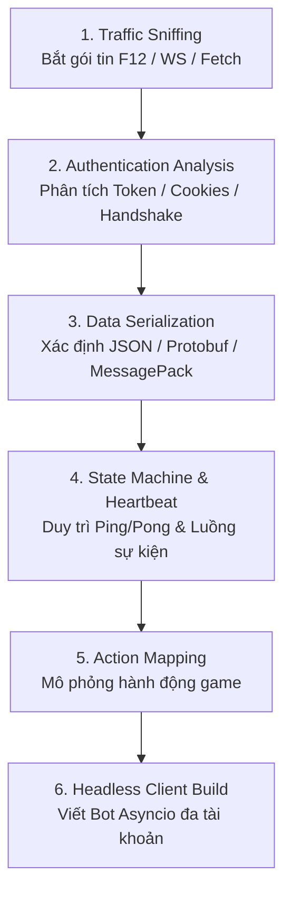

# Nghiên Cứu & Kế Hoạch Triển Khai: Protocol / Socket-Based Bot (Socket Research)

> **Mục tiêu:** Nghiên cứu và chuyển đổi kiến trúc bot từ giải pháp nhận diện hình ảnh (Playwright + Canvas Screenshot) sang mô hình mô phỏng giao thức mạng trực tiếp (Protocol/WebSocket/REST Client). Giải pháp này nhằm tối ưu hóa 90-99% tài nguyên (CPU/RAM), cho phép vận hành đồng thời số lượng lớn (SLL) tài khoản trên máy chủ cấu hình thấp với chi phí tối thiểu.

---

## 1. So Sánh Các Kiến Trúc Tự Động Hóa (Architecture Overview)

```mermaid
graph TD
    subgraph "Cấp độ 0: Vision Bot (Hiện tại)"
        A1[Playwright / Chrome] --> A2[Canvas Render]
        A2 --> A3[Screenshot Loop]
        A3 --> A4[CV / Image Processing]
        A4 --> A5[Mouse/Keyboard Emulation]
    end

    subgraph "Cấp độ 1: JS Hook Bot"
        B1[Playwright Headless] --> B2[JS Evaluation / CDP]
        B2 --> B3[Read Game State in Memory]
        B3 --> B4[Direct Function Invocation]
    end

    subgraph "Cấp độ 2: Protocol / Socket Bot (Mục tiêu)"
        C1[Python / Node.js Engine] --> C2[Direct TCP / WSS / HTTPS]
        C2 --> C3[Raw Packet / JSON / Protobuf]
        C3 --> C4[Server Game State]
    end
```



### Bảng so sánh tài nguyên & hiệu năng

| Tiêu chí | Cấp độ 0: Playwright Vision Bot | Cấp độ 1: JS Hook Bot | Cấp độ 2: Protocol / Socket Bot |
| :--- | :--- | :--- | :--- |
| **Mức tiêu hao RAM** | 200MB – 450MB / account | 80MB – 150MB / account | **5MB – 15MB / account** |
| **Mức tiêu hao CPU** | Rất cao (Render + Encode PNG + CV) | Trung bình (V8 Engine + DOM) | **Cực thấp (Async I/O + Serialize)** |
| **Quy mô trên 1 VPS 8GB RAM** | ~15 – 25 acc | ~40 – 70 acc | **1,000 – 3,000 acc** |
| **Phụ thuộc Browser** | Bắt buộc (Blink, Chromium) | Bắt buộc (Headless) | **Không (Chạy script độc lập)** |
| **Tốc độ phản hồi** | 200ms – 1000ms (Độ trễ frame) | 50ms – 100ms | **1ms – 10ms (Gần như tức thì)** |
| **Độ ổn định** | Dễ crash do lag canvas/leak RAM | Ổn định | **Rất cao** |

---

## 2. Bối Cảnh Công Cụ: Tại Sao Không Dùng WPE Pro?

* **Winsock Packet Editor (WPE Pro):**
  * Từng phổ biến trên các game desktop cổ điển (MU Online, Võ Lâm, Gunbound) bằng cách hook vào `ws2_32.dll` trên Windows.
  * **Không áp dụng được cho Web/Browser Game hiện đại** vì toàn bộ traffic của trình duyệt đều được bọc trong lớp mã hóa **TLS/SSL (HTTPS và WSS - Secure WebSocket)**. Dữ liệu bắt ở tầng socket hệ điều hành chỉ là các gói tin nhị phân đã bị mã hóa.
  * Browser hiện đại chạy trong kiến trúc Sandbox đa tiến trình, việc hook bên ngoài dễ bị hệ thống bảo mật hoặc trình duyệt chặn.

### Bộ công cụ hiện đại thay thế:
1. **Chrome / Firefox DevTools (F12):**
   * Tab **Network**: Lọc `WS` (WebSocket) hoặc `Fetch/XHR` để xem toàn bộ nội dung bản rõ trước khi mã hóa TLS.
   * Tab **Sources**: De-minify/Pretty-print mã nguồn JS của game để tìm schema và cấu trúc dữ liệu.
2. **mitmproxy / Fiddler / Charles Proxy:**
   * Cài đặt Root CA certificate để giải mã, xem và can thiệp HTTPS/WSS traffic ở tầng ứng dụng.
3. **Wireshark:**
   * Phân tích tầng sâu mạng nếu game dùng giao thức UDP / WebRTC tùy biến.

---

## 3. Quy Trình Nghiên Cứu Giao Thức (Protocol Research Workflow)



### Bước 1: Khảo sát Luồng Giao Tiếp (Traffic Sniffing)
* Mở DevTools (`F12`), vào tab **Network**.
* Bật bộ lọc:
  * **WS:** Kiểm tra xem game có mở kết nối `wss://` liên tục không.
  * **Fetch/XHR:** Kiểm tra xem game có gửi API REST dạng `POST/GET` khi thao tác không.
* Quan sát các frame:
  * **Send (Gửi đi):** Client gửi dữ liệu gì khi click/thao tác?
  * **Receive (Nhận về):** Server trả về trạng thái gì?

### Bước 2: Phân tích Cơ chế Xác thực (Authentication)
Xác định token và phiên đăng nhập được cấp phát như thế nào:
* **HTTP API:** Tìm Header `Authorization: Bearer <JWT>`, Cookies (`session_id`), hoặc Query params.
* **WebSocket Handshake:**
  * Token nằm trong URL: `wss://game.server/ws?token=xyz`
  * Hoặc token nằm trong gói tin đầu tiên sau khi kết nối (`{"action": "auth", "token": "..."}`).

### Bước 3: Giải mã Định dạng Dữ liệu (Serialization)
* **Trường hợp A: Text / JSON (Phổ biến nhất):**
  * Dữ liệu đọc được trực tiếp: `{"cmd": "attack", "target": 102}` hoặc định dạng Socket.io `42["event", {...}]`.
* **Trường hợp B: Binary (Protobuf / FlatBuffers / MessagePack / Custom Bytes):**
  * Frame hiển thị dạng `ArrayBuffer` hoặc hex.
  * Cách xử lý: Tìm kiếm trong tab **Sources** các từ khóa: `protobuf`, `decode`, `encode`, `.proto`, `msgpack`. Trích xuất schema hoặc logic pack/unpack sang Python.

### Bước 4: Xử lý Heartbeat (Ping/Pong) & Kết Nối Bền Vững
* Hầu hết server game sẽ ngắt kết nối sau 30-60 giây nếu client không gửi heartbeat.
* Cần xác định chu kỳ ping (ví dụ: mỗi 15s gửi `{"type": "ping"}` hoặc mã byte `0x09`).

---

## 4. Kiến Trúc Mã Nguồn Bot Protocol (Mẫu Python Asyncio)

Kiến trúc chuẩn sử dụng `asyncio` và `websockets`/`httpx` cho phép 1 tiến trình xử lý hàng nghìn kết nối đồng thời non-blocking:

```python
import asyncio
import json
import logging
from typing import Optional
import websockets

logging.basicConfig(level=logging.INFO, format="%(asctime)s [%(levelname)s] %(message)s")

class GameSocketClient:
    def __init__(self, account_id: str, auth_token: str, server_url: str):
        self.account_id = account_id
        self.auth_token = auth_token
        self.server_url = server_url
        self.ws: Optional[websockets.WebSocketClientProtocol] = None
        self.is_running = False

    async def connect(self):
        """Khởi tạo kết nối WebSocket với custom headers"""
        headers = {
            "User-Agent": "Mozilla/5.0 (Windows NT 10.0; Win64; x64)...",
            "Authorization": f"Bearer {self.auth_token}"
        }
        self.ws = await websockets.connect(self.server_url, extra_headers=headers)
        self.is_running = True
        logging.info(f"[{self.account_id}] Đã kết nối thành công tới WebSocket Server.")

    async def heartbeat_loop(self):
        """Giữ kết nối luôn sống định kỳ"""
        while self.is_running:
            try:
                await asyncio.sleep(20)
                if self.ws and self.ws.open:
                    await self.ws.send(json.dumps({"type": "ping"}))
            except Exception as e:
                logging.error(f"[{self.account_id}] Lỗi Heartbeat: {e}")
                break

    async def message_handler_loop(self):
        """Lắng nghe các sự kiện từ server và thực hiện logic nghiệp vụ"""
        while self.is_running:
            try:
                raw_message = await self.ws.recv()
                data = json.loads(raw_message)
                await self.on_message(data)
            except websockets.ConnectionClosed:
                logging.warning(f"[{self.account_id}] Kết nối bị ngắt từ phía server.")
                break
            except Exception as e:
                logging.error(f"[{self.account_id}] Lỗi xử lý message: {e}")

    async def on_message(self, data: dict):
        """Dispatch xử lý sự kiện trong game"""
        event_type = data.get("type")
        
        if event_type == "game_state":
            hp = data.get("hp", 0)
            score = data.get("score", 0)
            # Tự động gửi hành động nếu đạt điều kiện
            if hp > 50:
                await self.send_action("attack", {"target_id": data.get("nearest_enemy_id")})

        elif event_type == "reward_available":
            await self.send_action("claim_reward", {"reward_id": data.get("reward_id")})

    async def send_action(self, action_name: str, payload: dict):
        """Đóng gói và gửi hành động lên server"""
        if self.ws and self.ws.open:
            packet = {
                "action": action_name,
                "data": payload,
                "account_id": self.account_id
            }
            await self.ws.send(json.dumps(packet))
            logging.info(f"[{self.account_id}] Đã gửi action: {action_name}")

    async def run(self):
        """Chạy toàn bộ vòng đời của 1 tài khoản"""
        try:
            await self.connect()
            await asyncio.gather(
                self.heartbeat_loop(),
                self.message_handler_loop()
            )
        finally:
            self.is_running = False
            if self.ws:
                await self.ws.close()

# Quản lý hàng loạt tài khoản đồng thời
async def main():
    accounts = [
        {"id": "acc_01", "token": "token_01"},
        {"id": "acc_02", "token": "token_02"},
        {"id": "acc_03", "token": "token_03"},
    ]
    server_url = "wss://example-game.com/live"
    
    clients = [
        GameSocketClient(acc["id"], acc["token"], server_url).run()
        for acc in accounts
    ]
    await asyncio.gather(*clients)

if __name__ == "__main__":
    asyncio.run(main())
```

---

## 5. Kế Hoạch Triển Khai Chi Tiết (Milestones & Roadmap)

| Giai đoạn | Nhiệm vụ chính | Kết quả đầu ra (Deliverables) |
| :--- | :--- | :--- |
| **Phase 1: Khảo sát Network** | Mở F12 trên game thực tế, ghi lại toàn bộ endpoints HTTP và kết nối WebSocket. | Tài liệu `network_endpoints.md` chứa danh sách URLs, Headers, Payload mẫu. |
| **Phase 2: Giải mã Schema** | Xác định định dạng (JSON hay Binary). Trích xuất danh sách event types và payload parameters. | File Python Schema hoặc Model dữ liệu (`models.py` / `pydantic`). |
| **Phase 3: Core Socket Engine** | Xây dựng class kết nối WebSocket, xử lý Auth Handshake, Auto Reconnect và Heartbeat. | Module `socket_client.py` hoàn chỉnh và test kết nối thành công 1 tài khoản. |
| **Phase 4: Game Automation Flow** | Viết state machine xử lý logic chơi game (nhận diện trạng thái, gửi action đúng nhịp). | Bot chạy tự động hoàn chỉnh cho 1 tài khoản. |
| **Phase 5: Multi-Account & Proxy Pool** | Tích hợp quản lý danh sách accounts, proxy xoay vòng / proxy tĩnh cho từng acc, ghi log & cảnh báo. | Khả năng scale chạy 100 - 1,000 acc trên 1 VPS duy nhất. |

---

## 6. Biện Pháp Phòng Ngừa & Chống Phát Hiện (Anti-Bot & Risk Mitigation)

Khi chạy SLL thông qua socket/API, cần lưu ý các yếu tố sau để tránh bị server gắn cờ (flag) hoặc ban hàng loạt:

1. **Jitter & Randomization (Độ trễ ngẫu nhiên):**
   * Không bao giờ gửi các action theo khoảng thời gian cố định (ví dụ chính xác 1000ms).
   * Luôn thêm `random.uniform(0.1, 0.4)` giây vào giữa các hành động để mô phỏng hành vi con người.
2. **User-Agent & Fingerprint Headers:**
   * Giả lập đầy đủ các Header chuẩn của trình duyệt (`User-Agent`, `Origin`, `Referer`, `Accept-Language`, `Sec-WebSocket-Extensions`).
3. **Phân phối IP (Proxy Integration):**
   * Nếu chạy >50 acc, gắn mỗi acc (hoặc mỗi nhóm 5-10 acc) với 1 HTTP/SOCKS5 Proxy riêng biệt để tránh bị giới hạn kết nối theo IP (Rate Limit/IP ban).
4. **Heartbeat & Packet Order:**
   * Tuân thủ nghiêm ngặt thứ tự gửi gói tin giống hệt như khi chơi trên trình duyệt thật (Handshake -> Load Config -> Init State -> Game Loop).
