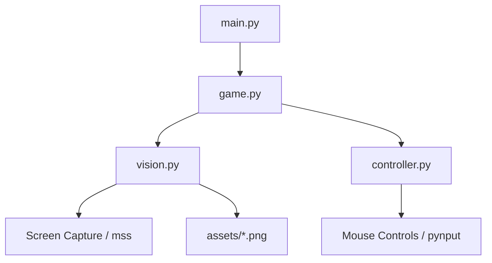

# Project Review: Burrito Bison Bot

This document provides a comprehensive review of the `burrito-bison-bot` project. It covers the system architecture, file structure, test suite status, detailed deductions of all image assets, identified issues/bugs, and recommended improvements.

---

## 1. Project Overview & Architecture

The `burrito-bison-bot` is a Python-based computer vision bot designed to automate gameplay for the game **Burrito Bison: Launcha Libre**. It uses screen capturing (`mss`), template matching (`opencv-python`/`cv2`), and simulated mouse inputs (`pynput`) to run the game autonomously.

### Core Architecture



*   **[main.py](main.py)**: The main entry point. Instantiates dependencies and runs the bot loop.
*   **[game.py](file:///D:/myData/teemp/burrito-bison-bot/game.py)**: Implements the main state machine (`not started`, `started`, `mission_finished`) and game flow logic.
*   **[vision.py](file:///D:/myData/teemp/burrito-bison-bot/vision.py)**: Coordinates screen captures and uses OpenCV's template matching to locate game UI components.
*   **[controller.py](file:///D:/myData/teemp/burrito-bison-bot/controller.py)**: Handles mouse gestures, clicks, and dragging to interact with the game.

---

## 2. File & Directory Structure

```
burrito-bison-bot/
├── assets/                    # Image templates used for matching game states/UI
├── docs/                      # Documentation
│   └── review.md              # This review report
├── tests/                     # Test suite
│   ├── screens/               # Saved game screenshots used as test inputs
│   ├── __init__.py
│   └── test_vision.py         # Unit tests validating template matches
├── website/                   # Local hosting for the game
│   └── index.html             # HTML wrapper embedding the game in an iframe
├── controller.py              # Mouse input controller
├── game.py                    # Core game loop and state machine
├── pyproject.toml             # Project metadata and dependencies
├── uv.lock                    # Locked dependency versions
├── main.py                     # Entry point script
└── vision.py                  # Computer vision and template matching module
```

---

## 3. Image Asset Analysis & Deduction

In accordance with instructions, the image contents have not been directly read. Instead, their meanings are deduced from filenames, test cases, and code references.

### Production Templates (`assets/`)

| Image File Name | Code References | Deduced Meaning / Role |
| :--- | :--- | :--- |
| `bison-head.png` | `vision.py` | Represents the head of the main character (Bison). Currently only used in tests to detect Bison's presence. |
| `bison-health-bar.png` | `game.py`, `vision.py` | Health bar indicator for the Bison character. Used to detect if the game has started with Bison. |
| `cancel-button.png` | `game.py`, `vision.py` | The "Cancel" button. Used to dismiss the Pinata pop-up/advertisement screen. |
| `filled-with-goodies.png` | `game.py`, `vision.py` | Banner text on the Pinata screen ("Filled with goodies"). Used to identify the active Pinata screen state. |
| `full-rocket.png` | `game.py`, `vision.py` | Indicator showing that the rocket booster is fully charged and ready to be clicked. |
| `left-goalpost.png` | `game.py`, `vision.py` | Left goalpost of the ring. Used as the anchor point to drag the slingshot and launch the player. |
| `next-button.png` | `game.py`, `vision.py` | The "Next" button on results pages. Used to transition back to the starting state of a new round. |
| `pineapple-head.png` | `vision.py` | The head of the Pineapple Spank character. Registered as a template but not currently used in game logic. |
| `pineapple-health-bar.png` | `game.py`, `vision.py` | Health bar indicator for Pineapple Spank. Used to detect if the game has started with Pineapple. |
| `tap-to-continue.png` | `game.py`, `vision.py` | "Tap to Continue" banner showing the round is finished. Clicked to go to results. |
| `unlocked.png` | `vision.py` | Visual signifier for unlocks (e.g. upgrades or characters). Registered but not used by the bot. |

### Test Mock Screens (`tests/screens/`)

These screenshots are used as mock environments in `test_vision.py` to assert that the vision matching routines function correctly.

*   `pinata.png`: Screen with active Pinata minigame pop-up. Contains `filled-with-goodies` and `cancel-button`.
*   `round-finished-missions.png`: Screen shown when the player completes a mission, requiring clicking `tap-to-continue`.
*   `round-finished-results.png`: Screen showcasing summary stats, containing `next-button`.
*   `round-in-progress-pineapple-spank.png`: active gameplay screen with Pineapple Spank, used to test goalpost matching.
*   `round-in-progress.png`: active gameplay screen with Bison, featuring the rocket meter filled (`full-rocket`).
*   `round-start-beaster-bunny.png`: Launch ring setup against the Beaster Bunny opponent.
*   `round-started.png`: Launch ring setup with Bison. Used to test `bison-head` and `bison-health-bar` matching.
*   `shop-upgrades.png`: Shop screen where player buys upgrades. (Unused in logic, possibly intended for future shopping features).
*   `unlocked.png`: Popup screen signaling an unlock. (Unused in logic).

---

## 4. Test Suite Status

The test suite in **[test_vision.py](file:///D:/myData/teemp/burrito-bison-bot/tests/test_vision.py)** consists of **9 test cases**. They run successfully:

```
Ran 9 tests in 0.756s
OK
```

### Analysis of Test Cases
- Tests load mock screenshots from `tests/screens/` and call template matching functions.
- Confirms the robustness of standard matches and scaled template matches (like scaling the goalpost template across different resolutions/opponents).

---

## 5. Identified Issues & Code Quality Concerns

### A. Critical Bug: Mouse Movement Timing Evaluation
In **[controller.py](file:///D:/myData/teemp/burrito-bison-bot/controller.py#L11-L20)**:
```python
def smooth_move_mouse(from_x, from_y, to_x, to_y, speed=0.2):
    steps = 40
    sleep_per_step = speed // steps
```
- **The Issue**: Uses integer division (`//`). Because `speed` is a float (`0.2`) and smaller than `steps` (`40`), `0.2 // 40` evaluates to `0.0`.
- **Impact**: `sleep_per_step` is `0.0`, resulting in no delay during the loop. The mouse snaps to the destination instantly instead of moving smoothly, which might trigger anti-cheat or fail to simulate human behavior properly.
- **Fix**: Change to standard float division: `sleep_per_step = speed / steps`.

### B. Unsafe Coordinate Access / Crash Risk
In **[game.py](file:///D:/myData/teemp/burrito-bison-bot/game.py)**:
Methods like `launch_player`, `click_to_continue`, `start_round`, `use_full_rocket`, and `click_cancel` directly extract coordinates:
```python
x = matches[1][0]
y = matches[0][0]
```
- **The Issue**: If the matching failed (returning empty lists), accessing element `[0]` will raise an `IndexError` and terminate the program.
- **Impact**: The bot is prone to crashing if the screen updates between the state evaluation and action invocation.
- **Fix**: Implement validation checks on matches before indexing:
  ```python
  if np.shape(matches)[1] < 1:
      self.log("Failed to locate template coordinates.")
      return
  ```

### C. Mismatched Test Name
In **[test_vision.py](file:///D:/myData/teemp/burrito-bison-bot/tests/test_vision.py#L31-L34)**:
```python
def test_finds_pineapple_head(self):
    screenshot = self.vision.get_image('tests/screens/round-in-progress-pineapple-spank.png')
    match = self.vision.scaled_find_template('left-goalpost', screenshot, threshold=0.75, scales=[1.1, 1.0, 0.99, 0.98, 0.97, 0.96, 0.95])
```
- **The Issue**: The test is named `test_finds_pineapple_head` but it actually matches `'left-goalpost'` on a screenshot that features the Pineapple Spank round. It does not test the `'pineapple-head'` template at all.
- **Fix**: Rename test or update it to match the actual template.

### D. Hardcoded Screen Settings
In **[vision.py](file:///D:/myData/teemp/burrito-bison-bot/vision.py#L25)**:
```python
self.monitor = {'top': 0, 'left': 0, 'width': 1920, 'height': 1080}
```
- **The Issue**: The monitor area is fixed to 1920x1080. If users run the bot on smaller screens, it will grab outer screen areas or fail to capture the browser correctly.
- **Fix**: Read the screen resolution dynamically or externalize monitor boundaries to a configuration file.

### E. Unused Templates
The templates `bison-head` (outside of tests) and `unlocked` are registered in `vision.py` but never referenced in the active game automation routines in `game.py`.

---

## 6. Recommendations & Roadmap

1.  **Fix the Float Division Bug**: Correct the `sleep_per_step` in `controller.py` to restore smooth mouse movements.
2.  **Safeguard Matches**: Add sanity checks to all indexing of matching arrays in `game.py`.
3.  **Upgrade Purchasing Loop**: Expand `game.py` to detect when the shop screen is active (`shop-upgrades.png`) and buy basic upgrades automatically to alleviate grinding.
4.  **Auto-Dismiss Unlocks**: Integrate a handler for the unlock window (`unlocked.png`) so the bot doesn't get stuck when a new item is unlocked.
5.  **Clean up tests**: Rename `test_finds_pineapple_head` to match its actual verification step and write a dedicated test for `pineapple-head` and `unlocked` templates.
